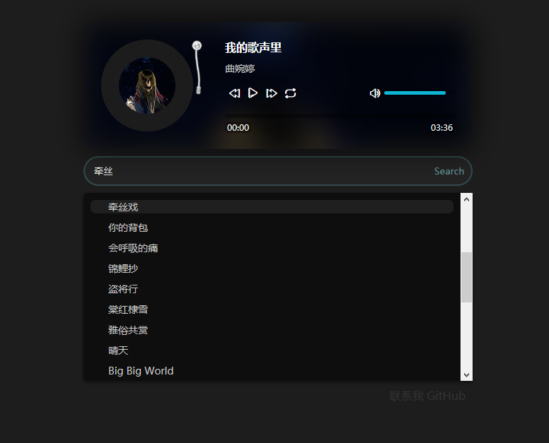

# Django框架搭建的音乐播放网页

## 工具能力
1. 音乐播放
2. 音乐列表
3. 搜索音乐

[>> 网页地址 <<](https://musicsharing.github.io/)

  
 
## 更新记录

- 2022-06-04 创建项目

## 致谢

本项目歌曲搜索功能通过以下项目修改而来, 在此致谢
- <https://github.com/ermaozi/django_songs.git>

## 免责声明

**禁止将本工具用于商业用途**，如产生法律纠纷与本人无关。
